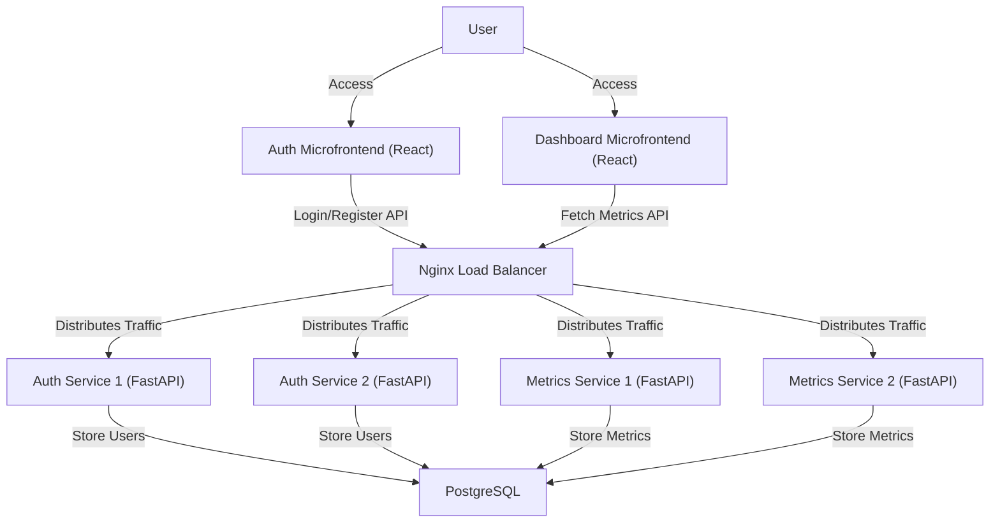

```mermaid
graph TD;
    %% User interactions with frontend services
    User["User"] -->|Access| AuthApp["Auth Microfrontend (React)"];
    User -->|Access| DashboardApp[" Dashboard Microfrontend (React)"];

    %% Nginx Load Balancing for backend services
    Nginx["Nginx Load Balancer"] -->|Distributes Traffic| AuthService1["Auth Service 1 (FastAPI)"];
    Nginx -->|Distributes Traffic| AuthService2["Auth Service 2 (FastAPI)"];
    Nginx -->|Distributes Traffic| MetricsService1["Metrics Service 1 (FastAPI)"];
    Nginx -->|Distributes Traffic| MetricsService2["Metrics Service 2 (FastAPI)"];

    %% Frontend to Nginx communication
    AuthApp -->|Login/Register API| Nginx;
    DashboardApp -->|Fetch Metrics API| Nginx;

    %% Backend services interactions
    AuthService1 -->|Store Users| Database["PostgreSQL"];
    AuthService2 -->|Store Users| Database;
    MetricsService1 -->|Store Metrics| Database;
    MetricsService2 -->|Store Metrics| Database;

```
